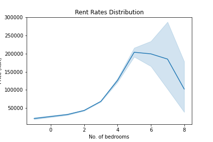

# 
Data Analysis & Visualization

#### Introduction
This is the second part of the rent data analysis project. In this section, I look at the trends in the data collected. First, I look for any outliers in the data and make the necessary adjustments.

#### Overview
Looking at following graphs, we can observe some general trends about the data:
1. In the first graph we can see that we have 5-bedroom apartments that cost more than 2.5 million Shillings (Ksh) or ~ \\$25000
2. This translates to more than Ksh 500,000 ($5000) per bedroom as shown in the second graph. 
3. There are one-bedroom apartments that cost more than 200,000 shillings. These are also quite expensive.

Let's take a closer look at the 5-bedroom apartments in order to drop or correct the outliers.
Using the summary statistics below we can see that a 5-bedroom apartment in the 75th percentile costs Ksh 300,000 ($3000).

        |   stat  |    value     |
        |---------|--------------|
        | mean    | 1.013779e+06 |
        | std     | 1.425785e+07 |
        | min     | 6.500000e+03 |
        | 25%     | 1.000000e+05 |
        | 50%     | 2.000000e+05 |
        | 75%     | 3.000000e+05 |
        | max     | 2.800000e+08 |

We can drop any apartment that costs more than $5000 and this gives us a reasonable distribution as shown below

The next step is to clean up data for 1 & 8-bedroom apartments. From the graphs above we can see that:
1. The cost per bedroom for 1-beroom apartments is higher than that for 5-bedroom apartments. 
2. Similarly, prices seem to drop drastically for apartments for six or more bedrooms apartments.

This is an indication of some anormaly in the data. Looking at the data closely, some of the errors are as a result of poor labeling or incorrectly extracting the number of bedrooms from their titles or descriptions. 

Some of the 8-bedroom apartments for instance were actually studio apartments that had the digit '8' in their addresses. By replacing them with the correct values we can see better linear relationship between prices and bedrooms

### Analysis
We can now plot the listings' distribution in order to answer some of the questions such as which apartment sizes are the most common?

Here are some of the observations:
1. Two bedrooms apartments had the highest number of listings followed by 3 & 1 bedrooms
2. Apartments with six or more bedrooms are not popular
3. Majority of the advertised apartments cost less than Ksh 100,000

Let's now take a look at how these prices compare across different towns.

As shown above:
1.  In most instances, prices are higher in Nairobi followed by Mombasa and Kajiado counties. 

Zooming in on Kilifi, Mombasa and Nairobi towns, we can see that Kilifi has the lowest rent prices followed by Mombasa.

